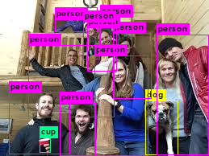
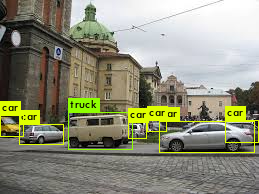

Darknet is an open source neural network framework written in C and CUDA
### [Darknet](./openAudioLibs.md#TOP)<a name = "Darknet"></a>
+ [features](#Darknet_features)
+ [install and usage](#Darknet_install)
+ [funtion list](#Darknet_list)  
+ [license](#Darknet_license)  

+ Option(modify Makefile)    
GPU  
CUDNN(NVIDIA CUDA® Deep Neural Network library)  
OPENCV  
OPENMP  

Default : [std](https://github.com/nothings/stb) for image format  

#### [FEAUTRES](#Darknet)<a name="Darknet_features"></a>  
1. YOLO: Real-Time Object Detection
2. ImageNet Classification
3. Nightmare : Backward neural networks 
4. rnn  
...


```C++
typedef struct matrix{
int rows, cols;
 float **vals;
} matrix;
```
---

#### [INSTALL AND USAGE](#Darknet)<a name = "Darknet_install"></a> 

```bash
git clone https://github.com/pjreddie/darknet.git 
cd darknet
make

usage: ./darknet <function>

wget https://pjreddie.com/media/files/yolov3.weights  # Trained DATA
./darknet detect cfg/yolov3.cfg yolov3.weights data/pic_you_want_to_text.jpg
```

  


---
#### [FUNCTION LIST](#Darknet)<a name="Darknet_list"></a>

<details><summary><b>darknet.h</b></summary>

```C++
pthread_t load_data(load_args args);
list *read_data_cfg(char *filename);
list *read_cfg(char *filename);
unsigned char *read_file(char *filename);
data resize_data(data orig, int w, int h);
data *tile_data(data orig, int divs, int size);
data select_data(data *orig, int *inds);

void forward_network(network *net);
void backward_network(network *net);
void update_network(network *net);


float dot_cpu(int N, float *X, int INCX, float *Y, int INCY);
void axpy_cpu(int N, float ALPHA, float *X, int INCX, float *Y, int INCY);
void copy_cpu(int N, float *X, int INCX, float *Y, int INCY);
void scal_cpu(int N, float ALPHA, float *X, int INCX);
void fill_cpu(int N, float ALPHA, float * X, int INCX);
void normalize_cpu(float *x, float *mean, float *variance, int batch, int filters, int spatial);
void softmax(float *input, int n, float temp, int stride, float *output);

int best_3d_shift_r(image a, image b, int min, int max);
#ifdef GPU
void axpy_gpu(int N, float ALPHA, float * X, int INCX, float * Y, int INCY);
void fill_gpu(int N, float ALPHA, float * X, int INCX);
void scal_gpu(int N, float ALPHA, float * X, int INCX);
void copy_gpu(int N, float * X, int INCX, float * Y, int INCY);

void cuda_set_device(int n);
void cuda_free(float *x_gpu);
float *cuda_make_array(float *x, size_t n);
void cuda_pull_array(float *x_gpu, float *x, size_t n);
float cuda_mag_array(float *x_gpu, size_t n);
void cuda_push_array(float *x_gpu, float *x, size_t n);

void forward_network_gpu(network *net);
void backward_network_gpu(network *net);
void update_network_gpu(network *net);

float train_networks(network **nets, int n, data d, int interval);
void sync_nets(network **nets, int n, int interval);
void harmless_update_network_gpu(network *net);
#endif
image get_label(image **characters, char *string, int size);
void draw_label(image a, int r, int c, image label, const float *rgb);
void save_image_png(image im, const char *name);
void get_next_batch(data d, int n, int offset, float *X, float *y);
void grayscale_image_3c(image im);
void normalize_image(image p);
void matrix_to_csv(matrix m);
float train_network_sgd(network *net, data d, int n);
void rgbgr_image(image im);
data copy_data(data d);
data concat_data(data d1, data d2);
data load_cifar10_data(char *filename);
float matrix_topk_accuracy(matrix truth, matrix guess, int k);
void matrix_add_matrix(matrix from, matrix to);
void scale_matrix(matrix m, float scale);
matrix csv_to_matrix(char *filename);
float *network_accuracies(network *net, data d, int n);
float train_network_datum(network *net);
image make_random_image(int w, int h, int c);

void denormalize_connected_layer(layer l);
void denormalize_convolutional_layer(layer l);
void statistics_connected_layer(layer l);
void rescale_weights(layer l, float scale, float trans);
void rgbgr_weights(layer l);
image *get_weights(layer l);

void demo(char *cfgfile, char *weightfile, float thresh, int cam_index, const char *filename, char **names, int classes, int frame_skip, char *prefix, int avg, float hier_thresh, int w, int h, int fps, int fullscreen);
void get_detection_detections(layer l, int w, int h, float thresh, detection *dets);

char *option_find_str(list *l, char *key, char *def);
int option_find_int(list *l, char *key, int def);
int option_find_int_quiet(list *l, char *key, int def);

network *parse_network_cfg(char *filename);
void save_weights(network *net, char *filename);
void load_weights(network *net, char *filename);
void save_weights_upto(network *net, char *filename, int cutoff);
void load_weights_upto(network *net, char *filename, int start, int cutoff);

void zero_objectness(layer l);
void get_region_detections(lay
```
</details>
&nbsp;

<details><summary><b>blas.h</b></summary>

```C++
 void flatten(float *x, int size, int layers, int batch, int forward);
void pm(int M, int N, float *A);
float *random_matrix(int rows, int cols);
void time_random_matrix(int TA, int TB, int m, int k, int n);
void reorg_cpu(float *x, int w, int h, int c, int batch, int stride, int forward, float *out);

void test_blas();

void inter_cpu(int NX, float *X, int NY, float *Y, int B, float *OUT);
void deinter_cpu(int NX, float *X, int NY, float *Y, int B, float *OUT);
void mult_add_into_cpu(int N, float *X, float *Y, float *Z);

void const_cpu(int N, float ALPHA, float *X, int INCX);
void constrain_gpu(int N, float ALPHA, float * X, int INCX);
void pow_cpu(int N, float ALPHA, float *X, int INCX, float *Y, int INCY);
void mul_cpu(int N, float *X, int INCX, float *Y, int INCY);

int test_gpu_blas();
void shortcut_cpu(int batch, int w1, int h1, int c1, float *add, int w2, int h2, int c2, float s1, float s2, float *out);

void mean_cpu(float *x, int batch, int filters, int spatial, float *mean);
void variance_cpu(float *x, float *mean, int batch, int filters, int spatial, float *variance);

void scale_bias(float *output, float *scales, int batch, int n, int size);
void backward_scale_cpu(float *x_norm, float *delta, int batch, int n, int size, float *scale_updates);
void mean_delta_cpu(float *delta, float *variance, int batch, int filters, int spatial, float *mean_delta);
void  variance_delta_cpu(float *x, float *delta, float *mean, float *variance, int batch, int filters, int spatial, float *variance_delta);
void normalize_delta_cpu(float *x, float *mean, float *variance, float *mean_delta, float *variance_delta, int batch, int filters, int spatial, float *delta);
void l2normalize_cpu(float *x, float *dx, int batch, int filters, int spatial);

void smooth_l1_cpu(int n, float *pred, float *truth, float *delta, float *error);
void l2_cpu(int n, float *pred, float *truth, float *delta, float *error);
void l1_cpu(int n, float *pred, float *truth, float *delta, float *error);
void logistic_x_ent_cpu(int n, float *pred, float *truth, float *delta, float *error);
void softmax_x_ent_cpu(int n, float *pred, float *truth, float *delta, float *error);
void weighted_sum_cpu(float *a, float *b, float *s, int num, float *c);
void weighted_delta_cpu(float *a, float *b, float *s, float *da, float *db, float *ds, int n, float *dc);

void softmax(float *input, int n, float temp, int stride, float *output);
void softmax_cpu(float *input, int n, int batch, int batch_offset, int groups, int group_offset, int stride, float temp, float *output);
void upsample_cpu(float *in, int w, int h, int c, int batch, int stride, int forward, float scale, float *out);

#ifdef GPU
#include "cuda.h"
#include "tree.h"

void axpy_gpu(int N, float ALPHA, float * X, int INCX, float * Y, int INCY);
void axpy_gpu_offset(int N, float ALPHA, float * X, int OFFX, int INCX, float * Y, int OFFY, int INCY);
void copy_gpu(int N, float * X, int INCX, float * Y, int INCY);
void copy_gpu_offset(int N, float * X, int OFFX, int INCX, float * Y, int OFFY, int INCY);
void add_gpu(int N, float ALPHA, float * X, int INCX);
void supp_gpu(int N, float ALPHA, float * X, int INCX);
void mask_gpu(int N, float * X, float mask_num, float * mask, float val);
void scale_mask_gpu(int N, float * X, float mask_num, float * mask, float scale);
void const_gpu(int N, float ALPHA, float *X, int INCX);
void pow_gpu(int N, float ALPHA, float *X, int INCX, float *Y, int INCY);
void mul_gpu(int N, float *X, int INCX, float *Y, int INCY);

void mean_gpu(float *x, int batch, int filters, int spatial, float *mean);
void variance_gpu(float *x, float *mean, int batch, int filters, int spatial, float *variance);
void normalize_gpu(float *x, float *mean, float *variance, int batch, int filters, int spatial);
void l2normalize_gpu(float *x, float *dx, int batch, int filters, int spatial);

void normalize_delta_gpu(float *x, float *mean, float *variance, float *mean_delta, float *variance_delta, int batch, int filters, int spatial, float *delta);

void fast_mean_delta_gpu(float *delta, float *variance, int batch, int filters, int spatial, float *mean_delta);
void fast_variance_delta_gpu(float *x, float *delta, float *mean, float *variance, int batch, int filters, int spatial, float *variance_delta);

void fast_variance_gpu(float *x, float *mean, int batch, int filters, int spatial, float *variance);
void fast_mean_gpu(float *x, int batch, int filters, int spatial, float *mean);
void shortcut_gpu(int batch, int w1, int h1, int c1, float *add, int w2, int h2, int c2, float s1, float s2, float *out);
void scale_bias_gpu(float *output, float *biases, int batch, int n, int size);
void backward_scale_gpu(float *x_norm, float *delta, int batch, int n, int size, float *scale_updates);
void scale_bias_gpu(float *output, float *biases, int batch, int n, int size);
void add_bias_gpu(float *output, float *biases, int batch, int n, int size);
void backward_bias_gpu(float *bias_updates, float *delta, int batch, int n, int size);

void logistic_x_ent_gpu(int n, float *pred, float *truth, float *delta, float *error);
void softmax_x_ent_gpu(int n, float *pred, float *truth, float *delta, float *error);
void smooth_l1_gpu(int n, float *pred, float *truth, float *delta, float *error);
void l2_gpu(int n, float *pred, float *truth, float *delta, float *error);
void l1_gpu(int n, float *pred, float *truth, float *delta, float *error);
void wgan_gpu(int n, float *pred, float *truth, float *delta, float *error);
void weighted_delta_gpu(float *a, float *b, float *s, float *da, float *db, float *ds, int num, float *dc);
void weighted_sum_gpu(float *a, float *b, float *s, int num, float *c);
void mult_add_into_gpu(int num, float *a, float *b, float *c);
void inter_gpu(int NX, float *X, int NY, float *Y, int B, float *OUT);
void deinter_gpu(int NX, float *X, int NY, float *Y, int B, float *OUT);

void reorg_gpu(float *x, int w, int h, int c, int batch, int stride, int forward, float *out);

void softmax_gpu(float *input, int n, int batch, int batch_offset, int groups, int group_offset, int stride, float temp, float *output);
void adam_update_gpu(float *w, float *d, float *m, float *v, float B1, float B2, float eps, float decay, float rate, int n, int batch, int t);
void adam_gpu(int n, float *x, float *m, float *v, float B1, float B2, float rate, float eps, int t);

void flatten_gpu(float *x, int spatial, int layers, int batch, int forward, float *out);
void softmax_tree(float *input, int spatial, int batch, int stride, float temp, float *output, tree hier);
void upsample_gpu(float *in, int w, int h, int c, int batch, int stride, int forward, float scale, float *out);

```
</details>
&nbsp;

<details><summary><b>gemm.h</b></summary>

```C++

void gemm_bin(int M, int N, int K, float ALPHA, 
        char  *A, int lda, 
        float *B, int ldb,
        float *C, int ldc);
        
void gemm(int TA, int TB, int M, int N, int K, float ALPHA, 
                    float *A, int lda, 
                    float *B, int ldb,
                    float BETA,
                    float *C, int ldc);

void gemm_cpu(int TA, int TB, int M, int N, int K, float ALPHA, 
        float *A, int lda, 
        float *B, int ldb,
        float BETA,
        float *C, int ldc);

#ifdef GPU
void gemm_gpu(int TA, int TB, int M, int N, int K, float ALPHA, 
        float *A_gpu, int lda, 
        float *B_gpu, int ldb,
        float BETA,
        float *C_gpu, int ldc);

void gemm_gpu(int TA, int TB, int M, int N, int K, float ALPHA, 
        float *A, int lda, 
        float *B, int ldb,
        float BETA,
        float *C, int ldc);
```      
</details>

&nbsp;


---

#### [LICENSE](#Darknet)<a name = "Darknet_license"></a>

그런거 없다  

<pre>
                                  YOLO LICENSE
                             Version 2, July 29 2016

THIS SOFTWARE LICENSE IS PROVIDED "ALL CAPS" SO THAT YOU KNOW IT IS SUPER
SERIOUS AND YOU DON'T MESS AROUND WITH COPYRIGHT LAW BECAUSE YOU WILL GET IN
TROUBLE HERE ARE SOME OTHER BUZZWORDS COMMONLY IN THESE THINGS WARRANTIES
LIABILITY CONTRACT TORT LIABLE CLAIMS RESTRICTION MERCHANTABILITY. NOW HERE'S
THE REAL LICENSE:

0. Darknet is public domain.
1. Do whatever you want with it.
2. Stop emailing me about it!
</pre>

---
